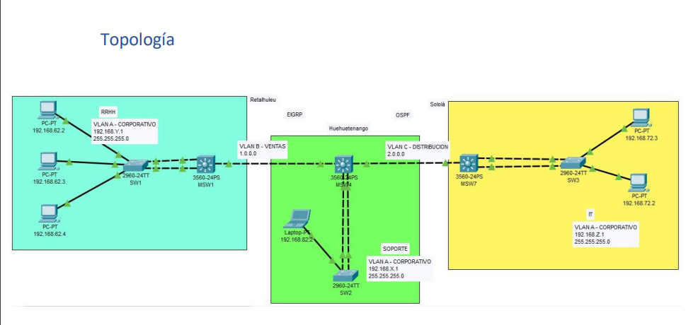

# MANUAL TECNICO PRACTICA NO. 2 

## Objetivos

- Realizar las configuraciones básicas del switch multicapa y del switch capa 2.
- Familiarizarse con protocolos de capa 3: RIP, OSPF, EIGRP y BGP.
- Familiarizarse con redes MAN y LAN.
- Conocer e implementar las diferentes interfaces de ipv4.
- Conocer e implementar LACP.
- Conocer e implementar la seguridad básica de un switch

## Definición del problema

Redeton es una empresa que se dedica a la creación y distribución de dispositivos tecnológicos. Actualmente la empresa cuenta con una sucursal en Huehuetenango, pero decidieron ampliar sus puntos de venta y ahora la empresa cuenta con 3 sucursales en toda Guatemala; la primera sucursal se encuentra en Retalhuleu, la segunda sucursal se encuentra en Huehuetenango y la tercera sucursal se encuentra en Sololá. 
Debido a la alta demanda que tiene la empresa sobre sus productos, necesitan conectar las tres sucursales para poder actualizar sus inventarios, listado de personal, dar soporte a las máquinas de sus empleados, etc. y de esta manera mantener el orden en su empresa.

Para mas informacion ver el documento completo en  [Redes2 Practica 2](https://uedi.ingenieria.usac.edu.gt/campus/pluginfile.php/764400/mod_resource/content/1/%5BREDES2%5DEnunciado_Practica2_1S2024.pdf).

---------------------------------------------------------
## Topología Utilizada



## Configuracion de VLAN

* CORPORATIVO61
* VENTAS11
* DISTRIBUCION21

## Interfaces de VLAN

* Numeros escogidos (`+` numero de grupo):
    * Y = 70 `->` 71
    * X = 80 `->` 81
    * Z = 90 `->` 91

* Direcciones de red:
    1. Corporativo:
        * RRHH: 192.168.71.1
        * SOPORTE: 192.168.81.1
        * IT: 192.168.91.1
        * Mascara para las direcciones de red: 255.255.255.0
    2. Ventas:
        * Direccion: 1.0.0.0
        * Mascara: 255.0.0.0
    3. DistribucionL
        * Direccion: 2.0.0.0
        * Mascara: 255.0.0.0

## Configuracion PCs

#### RETALHULEU

* PC1:
    * 192.168.71.3
    * 255.255.255.0
    * 192.168.71.1
* PC2:
    * 192.168.71.4
    * 255.255.255.0
    * 192.168.71.1
* PC3:
    * 192.168.71.5
    * 255.255.255.0
    * 192.168.71.1

#### HUEHUETENANGO

* PC4:
    * 192.168.81.6
    * 255.255.255.0
    * 192.168.81.1

#### SOLOLA

* PC5:
    * 192.168..
    * 255.255.255.0
    * 192.168..

* PC6:
    * 192.168..
    * 255.255.255.0
    * 192.168..

## Configuracion LACP

#### MSW1

```
enable
configure terminal
interface range fastEthernet 0/7-8
channel-protocol lacp
channel-group 1 mode active

show etherchannel summary
```

#### SW1

```
enable
configure terminal
interface range fastEthernet 0/7-8
channel-protocol lacp
channel-group 1 mode active

show etherchannel summary
```

#### MSW2

```
enable
configure terminal
interface range fastEthernet 0/14-15
channel-protocol lacp
channel-group 1 mode active

show etherchannel summary
```

#### SW2

```
enable
configure terminal
interface range fastEthernet 0/14-15
channel-protocol lacp
channel-group 1 mode active

show etherchannel summary
```

## Configuracion EIGRP

#### MSW1

* Crear VLANs:

```
enable
configure terminal
vlan 61
name CORPORATIVO61

vlan 11
name VENTAS11

show vlan
```

* Interfaces VLAN:

```
enable
configure terminal
interface vlan 61
ip address 192.168.71.1 255.255.255.0
no shutdown
exit

interface vlan 11
ip address 1.0.0.1 255.0.0.0
no shutdown
exit

show running-config
```

* Modo acceso:

```
enable
configure terminal
interface gigabitEthernet 0/1
switchport mode access
switchport access vlan 11

interface port-channel 1
switchport mode access
switchport access vlan 61

show running-config
```

* EIRGP:

```
enable
configure terminal
ip routing
router eigrp 50
network 1.0.0.0
network 192.168.71.0
network 192.168.81.0
no auto-summary

show running-config
```

#### MSW2

* Crear VLANs:

```
enable
configure terminal
vlan 61
name CORPORATIVO61

vlan 11
name VENTAS11

show vlan
```

* Interfaces VLAN:

```
enable
configure terminal
interface vlan 61
ip address 192.168.81.1 255.255.255.0
no shutdown
exit

interface vlan 11
ip address 1.0.0.2 255.0.0.0
no shutdown
exit

show running-config
```

* Modo acceso:

```
enable
configure terminal
interface gigabitEthernet 0/1
switchport mode access
switchport access vlan 11

interface port-channel 1
switchport mode access
switchport access vlan 61

show running-config
```

* EIRGP:

```
enable
configure terminal
ip routing
router eigrp 50
network 1.0.0.0
network 192.168.71.0
network 192.168.81.0
no auto-summary

show running-config
```