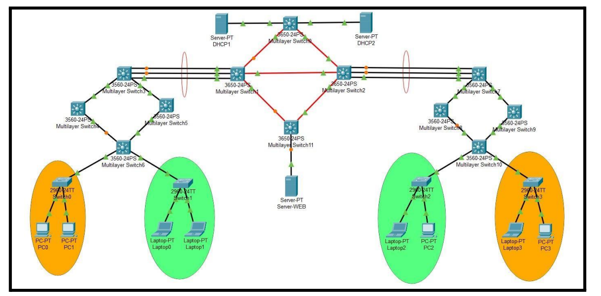

# Manual Técnico Proyecto 1

## Objetivos 
+ Realizar las configuraciones de switches multicapa y capa 2.
+ Implementar los protocolos de capa 3: RIP, OSPF, EIGRP y BGP.
+ Aplicar los conocimientos de redes MAN, LAN y WAN.
+ Aplicar los conocimientos de LACP.
+ Implementar el protocolo VTP.
+ Familiarizarse con el protocolo VRRP(HSRP).
+ Familiarizarse con las configuraciones de DHCP y sus conceptos.

## Definicion del Problema 
Manos Solidarias es una empresa comprometida con la responsabilidad social, se dedica a apoyar a personas en situación de escasez de recursos y sin hogar. Su enfoque se basa en brindar ayuda humanitaria y asistencia social a  quienes más lo necesitan, a través de diversos programas y proyectos que tienen como objetivo mejorar las condiciones de vida de estas personas. Con un equipo altamente capacitado y motivado, Manos Solidarias trabaja incansablemente para brindar apoyo a la comunidad y crear un mundo más
justo y equitativo para todos. Actualmente, deciden emprender su nueva red y lo contratan a usted, experto en redes para que haga todo el análisis correspondiente. Manos Solidarias cuenta con cuatro edificios en diferentes zonas de la ciudad, cada edificio es una red LAN que al mismo tiempo desean que estén conectados para tener comunicación.

## Topologías

### Topologia propuesta


### Topologia Completa


### Configuracion VTP 
#### Modo Servidor(sw0,msw5,msw0)
```
vtp domain g1
vtp mode server
exit
show vtp status
```
#### Modo Cliente(sw1,sw2,sw3,msw6,msw4,msw3,msw1,msw11,msw2,msw7,msw8,msw9,msw10)
```
vtp domain g1
vtp mode client
exit
show vtp status
```