# Manual técnico | Proyecto 3 

## Topología implementada

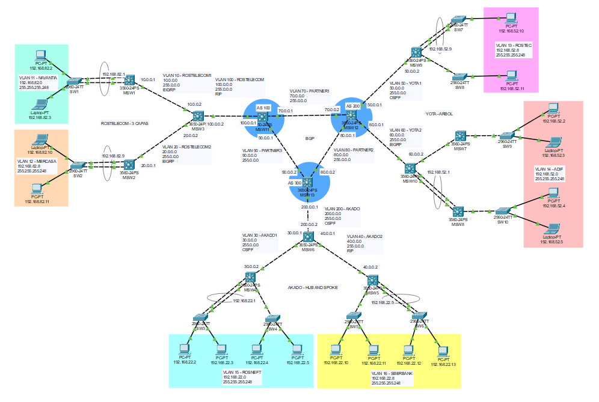

## Configuración de puertos

- Configuración de puertos en modo acceso para el contacto directo con dispositivos finales, y en este caso configuración de puertos trunked para una correcta comunicación utilizando el Port-Channel:

  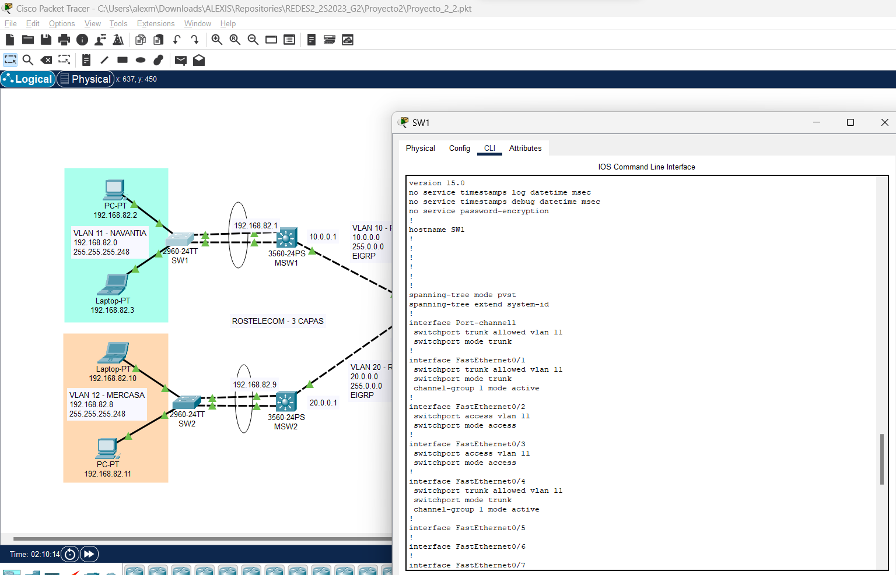

- Configuración de puertos en modo acceso, para una correcta comunicación entre los protocolos utilizados, como también para el InterVlan Routing de la siguiente manera:

  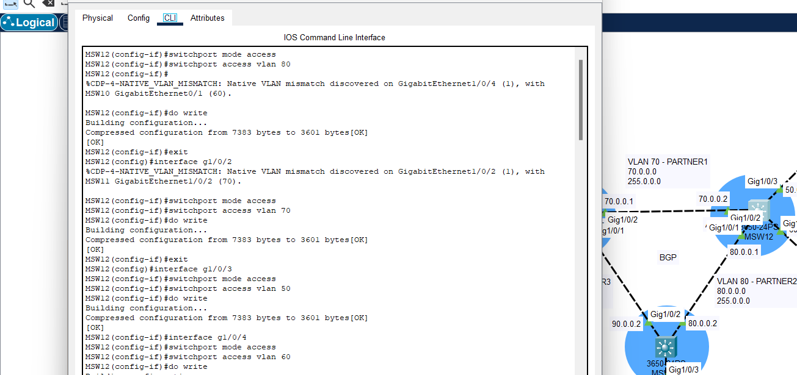

- Configuración de puertos trunked en un switch con conexión simple con otro:

  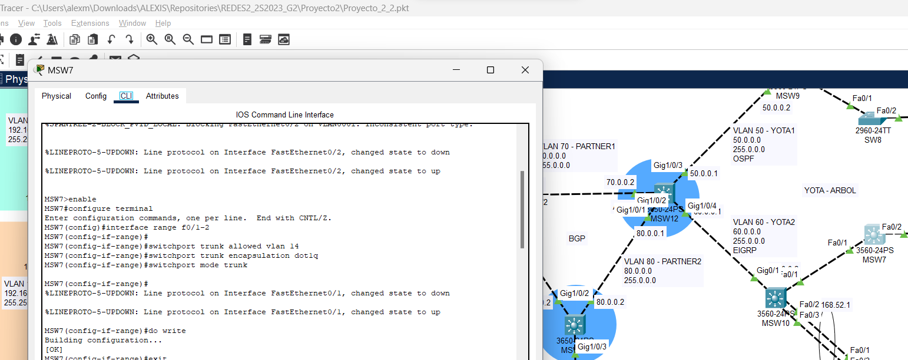

## Configuración de ISP Rostelecom

|    Área      |   Dirección  | Máscara de subred |
| ----------   | ------------ | ----------------- |
|  Navantia    | 192.168.82.0 | 255.255.255.248   |
|  Mercasa     | 192.168.82.8 | 255.255.255.248   |
|  Rostelecom  | 100.0.0.0    | 255.0.0.0         |
|  Rostelecom1 | 10.0.0.0     | 255.0.0.0         |
|  Rostelecom2 | 20.0.0.0     | 255.0.0.0         |

En el caso de las redes con máscara de subred 255.255.255.248, se eligió esta misma ya que cumple con las necesidades de cada subred, al ofrecer la disponibilidad de proveer ip a 8 dispositivos que es un poco más de lo que se requiere en cada red, implementando una topología de tipo 3 capas solicitada.

### VLAN

Iniciando esta configuración se tomó como base las VLAN's propuestas, como se muestra a continuación en la tabla:

| Nombre      | Número |
| ----------- | ------ |
|  Navantia    | 11    |
|  Mercasa     | 12    |
|  Rostelecom  | 100   |
|  Rostelecom1 | 10    |
|  Rostelecom2 | 20    |

Para realizar esta configuración, se ingresaron las VLAN's respectivamente a las que cada switch tenía conectadas directamente, como ejemplo se tiene el siguiente en el MSW3:

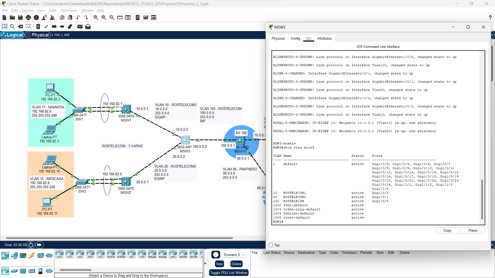

### InterVLAN Routing

El enrutamiento interVLAN permite que los dispositivos en diferentes VLANs se comuniquen entre sí, lo que es esencial en estas redes para controlar el tráfico y mejorar la seguridad, por lo que se configuró sobre cada uno de los switches capa 3 3650 del centro de la topología y también en Rostelecom como se muestra en los siguientes casos:

- Configuración sobre MSW1: se agregan las interfaces Vlan de las mismas que tiene conectadas directamente, en este caso la Vlan 11 y 10:

  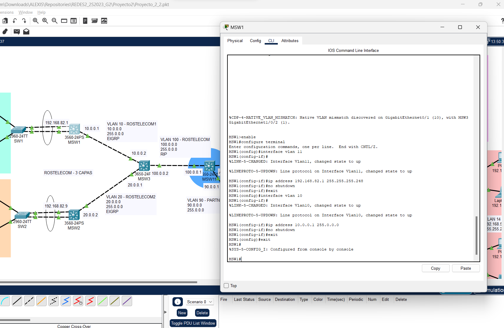

- Configuración sobre MSW3: se agregan las interfaces Vlan de las mismas que tiene conectadas directamente, en este caso la Vlan 10, 20 y 100:

## LACP (PortChannel)

Se realizó la configuración del PortChannel, donde es una técnica que se utiliza para combinar múltiples enlaces físicos en un solo enlace lógico de alta velocidad. Esto mejora la capacidad y la redundancia de la conexión entre dos dispositivos, por lo que a continuación se detalla la configuración el mismo:

- Configuración de un Switch 3560 para la realización del LACP, añadiendo los puertos Fa0/1, Fa0/2:

  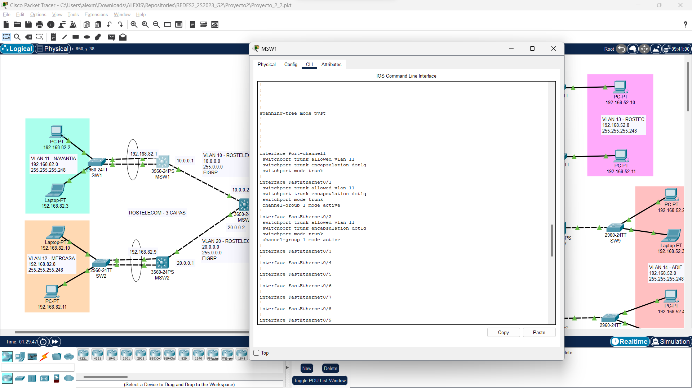

- Configuración de un Switch 2960 para la realización del LACP, añadiendo los puertos Fa0/1, Fa0/4:

### EIGRP

Se utilizó este protocolo de enrutamiento ya que ayuda a determinar la mejor ruta para enviar datos, el cuál es un protocolo desarrollado por Cisco que se basa en métricas como ancho de banda, retardo, confiabilidad y carga para calcular las rutas óptimas. Se realizó la configuración del protocolo EIGRP en los switches que enrutaban al protocolo RIP el cual lleva al área central de BGP.

- La configuración fue la siguiente en el switch MSW3:

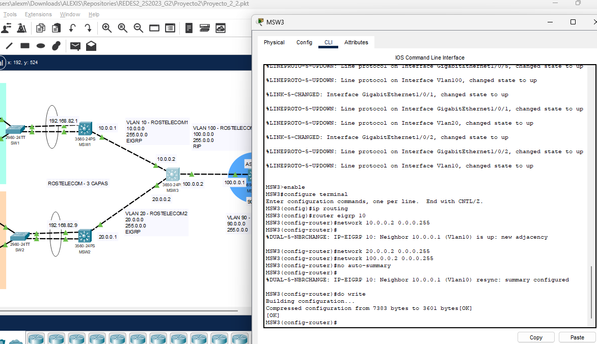

### RIP

Este es un protocolo de enrutamiento de vector de distancia que se utiliza en redes IP, el cuál es uno de los protocolos más antiguos y simples, ya que este se basa en la cuenta de saltos para determinar la mejor ruta se utilizó como puente entre los switches MSW3 y MSW11:

- Configuración de un Switch 3650(MSW3) para la realización del protocolo RIP añadiendo la version 2, con las redes conectadas directamente al switch:

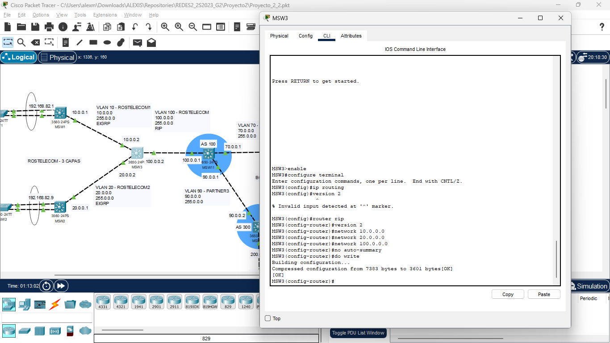

## Configuración de ISP Yota

Existen 4 redes dentro de este ISP con una dirección determinada con la detalladas en la siguiente tabla:

|    Área      |   Dirección  | Máscara de subred |
| ----------   | ------------ | ----------------- |
|  Rostec      | 192.168.52.8 | 255.255.255.248   |
|  Adif        | 192.168.52.0 | 255.255.255.248   |
|  Yota1       | 50.0.0.0     | 255.0.0.0         |
|  Yota2       | 60.0.0.0     | 255.0.0.0         |

En el caso de las redes con máscara de subred 255.255.255.248, se eligió esta misma ya que cumple con las necesidades de cada subred, al ofrecer la disponibilidad de proveer ip a 8 dispositivos que es un poco más de lo que se requiere en cada red, implementando una topología de tipo árbol solicitada.

  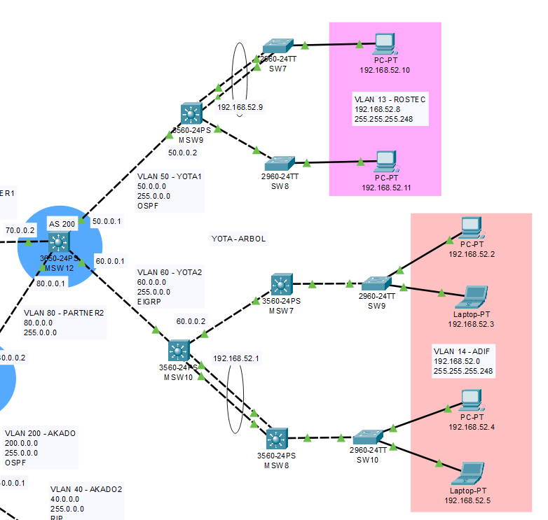

Para los dispositivos finales, se les agregó su respectiva Ip de forma manual en la interfaz gráfica proveida por Packet tracer de la siguiente manera:

  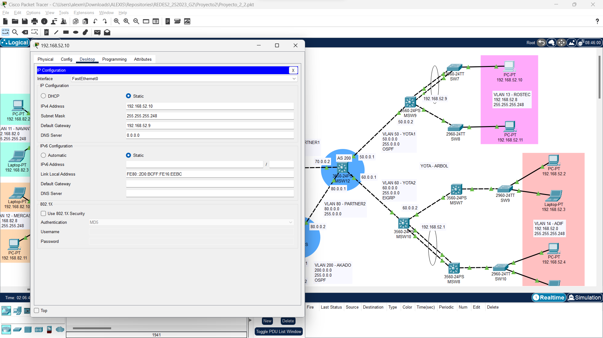

### VLAN

Iniciando esta configuración se tomó como base las VLAN's propuestas, como se muestra a continuación en la tabla:

| Nombre      | Número |
| ----------- | ------ |
|  Rostec     |  13    |
|  Adif       |  14    |
|  Yota1      |  50    |
|  Yota2      |  60    |

Para realizar esta configuración, se ingresaron las VLAN's respectivamente a las que cada switch tenía conectadas directamente, como ejemplo se tiene el siguiente en el MSW9:

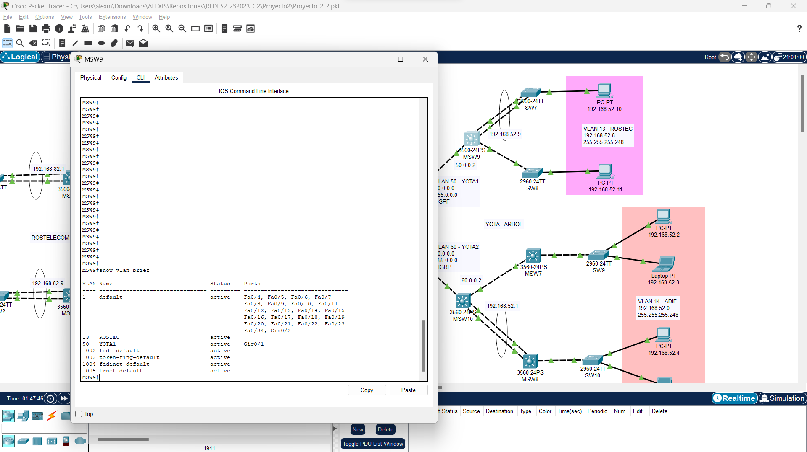

### InterVLAN Routing

El enrutamiento interVLAN permite que los dispositivos en diferentes VLANs se comuniquen entre sí, lo que es esencial en estas redes para controlar el tráfico y mejorar la seguridad, por lo que se configuró sobre cada uno de los switches capa 3 del centro de la topología y también en Yota como se muestra en los siguientes casos:

- Configuración sobre MSW9: se agregan las interfaces Vlan de las mismas que tiene conectadas directamente, en este caso la Vlan 13 y 50:

  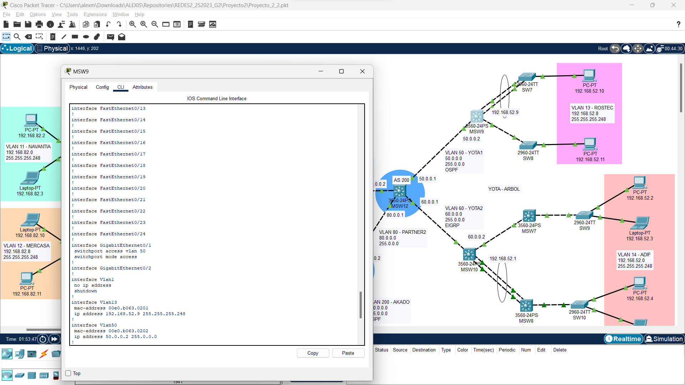

Este mismo concepto de agregar las interfaces Vlan de las que tiene directamente conectadas se realizó en todos los switches capa 3 de esta área.

## LACP (PortChannel)

Se realizó la configuración del PortChannel, donde es una técnica que se utiliza para combinar múltiples enlaces físicos en un solo enlace lógico de alta velocidad. Esto mejora la capacidad y la redundancia de la conexión entre dos dispositivos, por lo que a continuación se detalla la configuración el mismo:

- Configuración de un Switch 3560 para la realización del LACP, añadiendo los puertos Fa0/1, Fa0/3:

  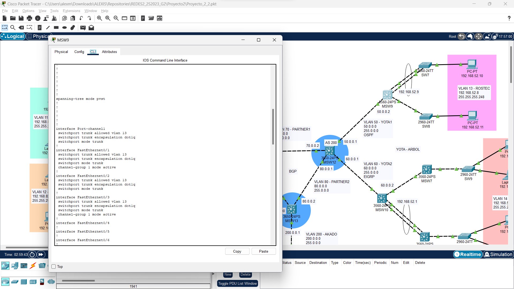

Esta misma configuración fué realizada en los switches con LACP de esta misma área, los switches MSW10 y MSW8.

### EIGRP

Se utilizó este protocolo de enrutamiento ya que ayuda a determinar la mejor ruta para enviar datos, el cuál es un protocolo desarrollado por Cisco que se basa en métricas como ancho de banda, retardo, confiabilidad y carga para calcular las rutas óptimas. Se realizó la configuración del protocolo EIGRP en los switches MSW12 y MSW10 que enrutaban al área central de BGP.

- La configuración es la siguiente en el switch MSW12:

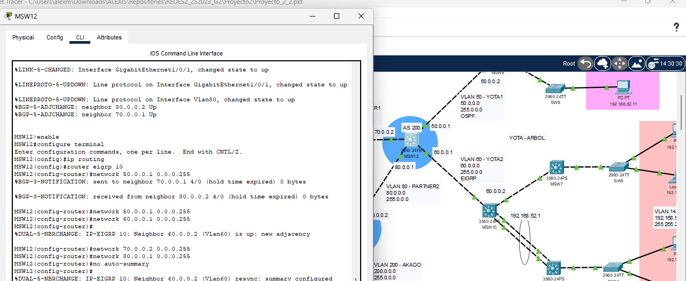

### OSPF

Es un protocolo de enrutamiento de estado de enlace de código abierto utilizado en redes IP. Su principal objetivo es calcular la ruta más corta para transmitir datos en una red mediante el intercambio de información sobre el estado de los enlaces entre routers. OSPF es ampliamente utilizado en redes empresariales y de proveedores de servicios, por lo que se realizó la configuración del protocolo OSPF en los switches MSW12 y MSW9 que enrutaban al área central de BGP.

- Configuración de un Switch 3650(MSW12) para la realización del protocolo OSPF, con las redes conectadas directamente al switch:

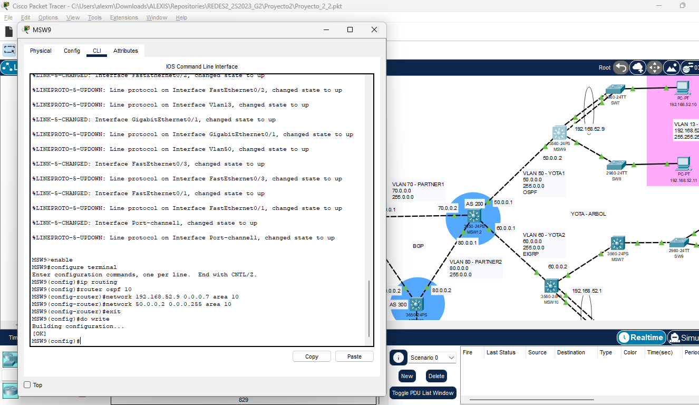

- Configuración de un Switch 3560(MSW9) para la realización del protocolo OSPF, con las redes conectadas directamente al switch:

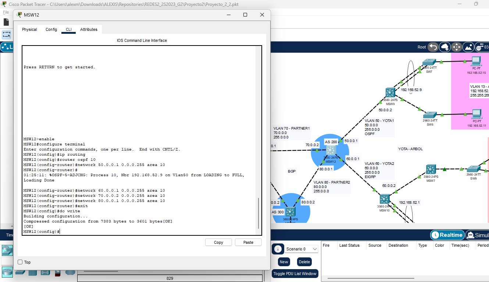

### Redistribute

Este es un proceso de compartir información de enrutamiento entre dos o más protocolos de enrutamiento diferentes dentro de una red. Esto se hizo para permitir que las rutas aprendidas a través de un protocolo de enrutamiento se vuelvan accesibles y utilizables por otro protocolo, por lo que se tiene lo siguiente:

- Configuración redistribute BGP-OSPF y OSPF-BGP:

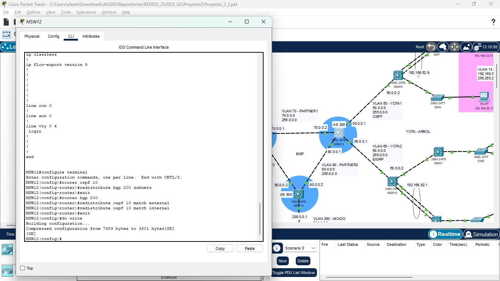

- Configuración redistribute BGP-EIGRP y EIGRP-BGP:

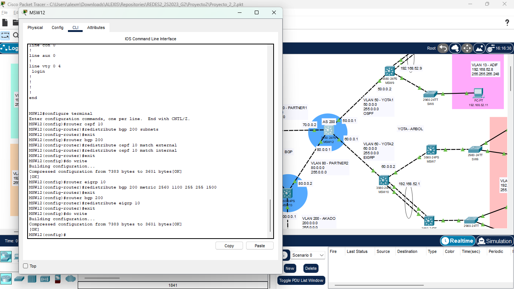

- Configuración redistribute EIGRP-OSPF y OSPF-EIGRP, para que la comunicación entre estos protocolos se realizara de la mejor manera.

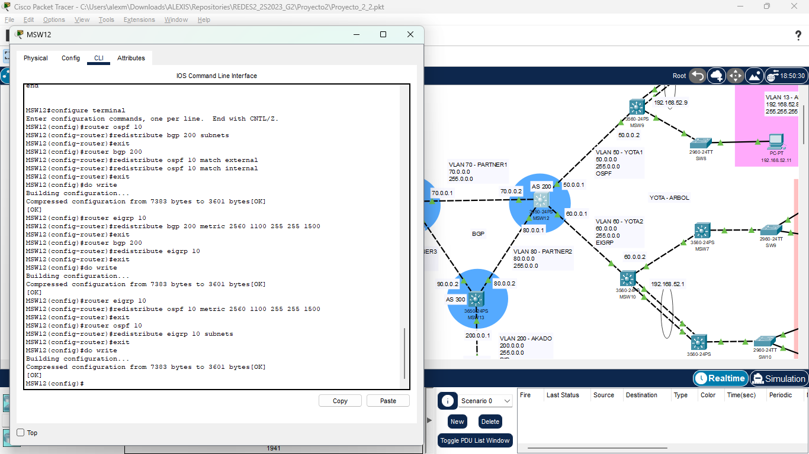

Para la obtención de los valores de redistribute con EIGRP, se procedió a hacer el comando "Show Inteface Vlan [interfaz-deseada]", lo que muestra la siguiente información:

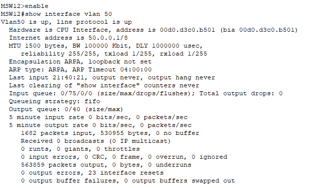

De estos valores se procede a realizar los respectivos calculos:

|    Variable   |   Valor    |
| ----------    | ---------- |
| Bandwidth    	| 1 000 000  |
| Load	        | 255        |
| Delay		      | 1000       |
| Reliability   |	255        |
| MTU	        	| 1500       |

    BW  = (10000000/1000000)*256 = 2560

    DLY = (1000/10)+(100/10)*100 = 1100

Obteniendo estos resultados, son los que se procedió a ingresar al realizar un redistribute con el protocolo EIGRP, estos siendo:

    metric 2560 1100 255 255 1500

## Configuración de ISP Akado

Existen 5 redes dentro de este ISP con una dirección determinada con la detalladas en la siguiente tabla:

|    Área       |   Dirección  | Máscara de subred |
| ----------    | ------------ | ----------------- |
|  Rosneft      | 192.168.22.0 | 255.255.255.248   |
|  Sberbank     | 192.168.22.8 | 255.255.255.248   |
|  Akado        | 200.0.0.0    | 255.0.0.0         |
|  Akado1       | 30.0.0.0     | 255.0.0.0         |
|  Akado2       | 40.0.0.0     | 255.0.0.0         |

En el caso de las redes con máscara de subred 255.255.255.248, se eligió esta misma ya que cumple con las necesidades de cada subred, al ofrecer la disponibilidad de proveer ip a 8 dispositivos que es un poco más de lo que se requiere en cada red, implementando una topología de tipo hub and spoke solicitada.

  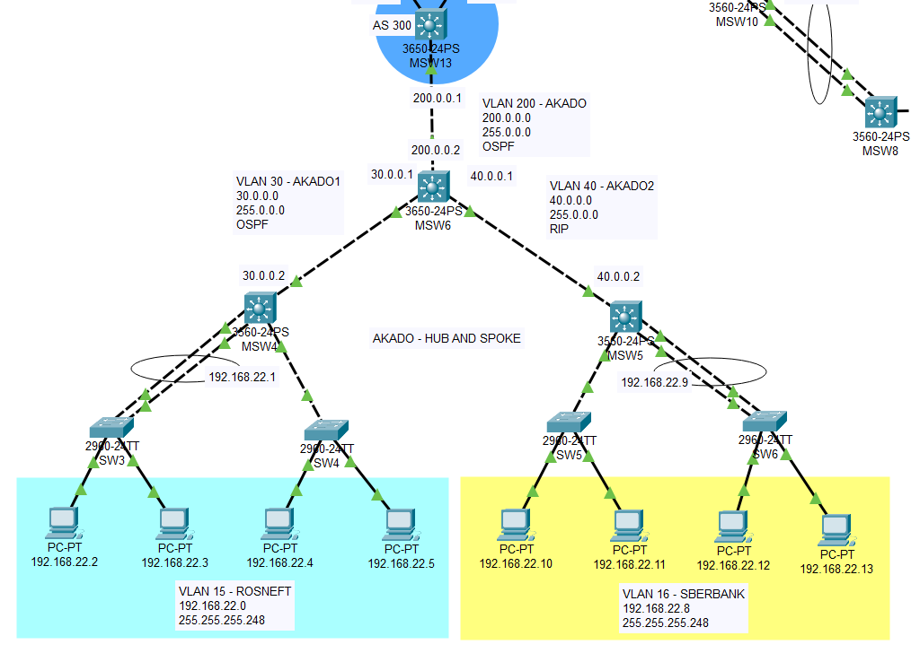

### VLAN

Iniciando esta configuración se tomó como base las VLAN's propuestas, como se muestra a continuación en la tabla:

| Nombre      | Número |
| ----------- | ------ |
|  Rosneft    |  15    |
|  Sberbank   |  16    |
|  Akado      |  200   |
|  Akado1     |  30    |
|  Akado2     |  40    |

Para realizar esta configuración, se ingresaron las VLAN's respectivamente a las que cada switch tenía conectadas directamente, como ejemplo se tiene el siguiente en el MSW6:

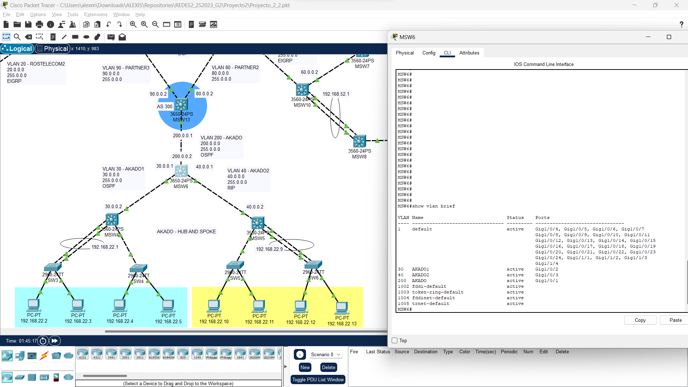

### InterVLAN Routing

El enrutamiento interVLAN permite que los dispositivos en diferentes VLANs se comuniquen entre sí, lo que es esencial en estas redes para controlar el tráfico y mejorar la seguridad, por lo que se configuró sobre cada uno de los switches capa 3 del centro de la topología y también en Yota como se muestra en los siguientes casos:

- Configuración sobre MSW6: se agregan las interfaces Vlan de las mismas que tiene conectadas directamente, en este caso la Vlan 30, 40 y 200:

  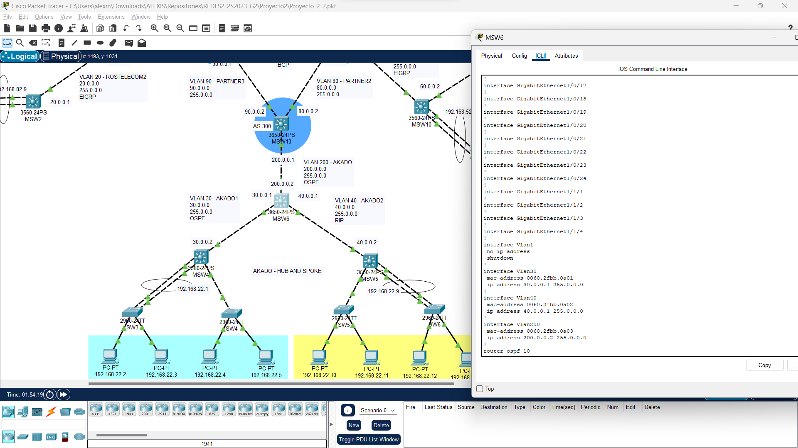

Este mismo concepto de agregar las interfaces Vlan de las que tiene directamente conectadas se realizó en todos los switches capa 3 de esta área.

## LACP (PortChannel)

Se realizó la configuración del PortChannel, donde es una técnica que se utiliza para combinar múltiples enlaces físicos en un solo enlace lógico de alta velocidad. Esto mejora la capacidad y la redundancia de la conexión entre dos dispositivos, por lo que a continuación se detalla la configuración el mismo:

- Configuración de un Switch 3560 para la realización del LACP, añadiendo los puertos Fa0/1, Fa0/4:

  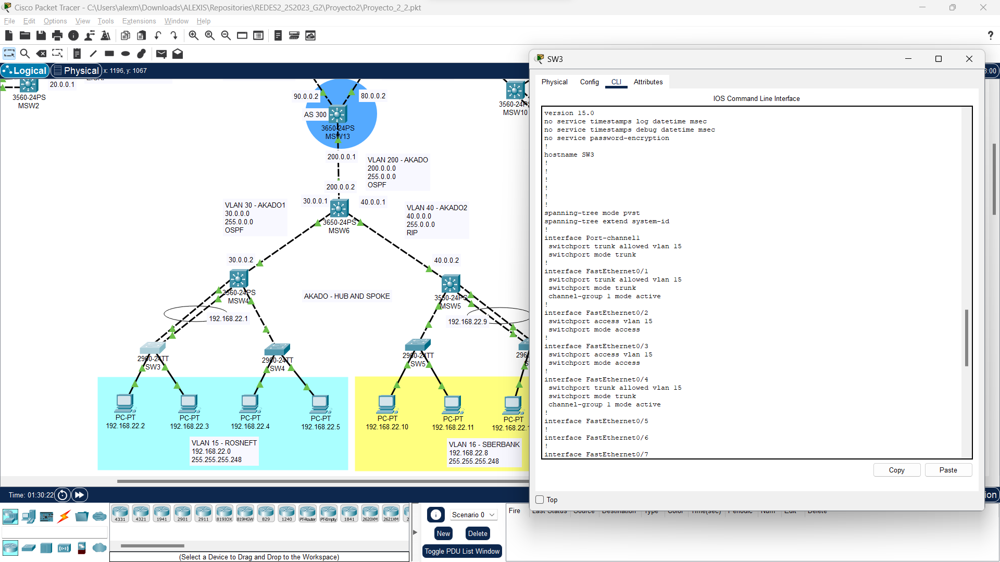

Esta misma configuración fué realizada en los switches con LACP de esta misma área, los switches MSW5 y SW6.

### OSPF

Es un protocolo de enrutamiento de estado de enlace de código abierto utilizado en redes IP. Su principal objetivo es calcular la ruta más corta para transmitir datos en una red mediante el intercambio de información sobre el estado de los enlaces entre routers. OSPF es ampliamente utilizado en redes empresariales y de proveedores de servicios, por lo que se realizó la configuración del protocolo OSPF en los switches MSW4, MSW6 y MSW13 que enrutaban al área central de BGP.

- Configuración de un Switch 3560(MSW4) para la realización del protocolo OSPF, con las redes conectadas directamente al switch:

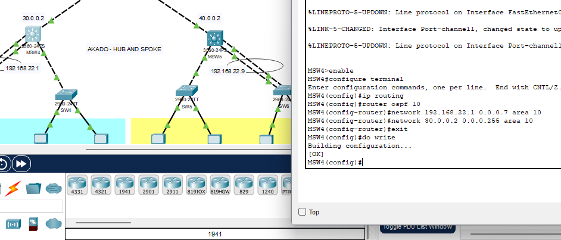

### RIP

Este es un protocolo de enrutamiento de vector de distancia que se utiliza en redes IP, el cuál es uno de los protocolos más antiguos y simples, ya que este se basa en la cuenta de saltos para determinar la mejor ruta se utilizó como puente entre los switches MSW6 y MSW5:

- Configuración de un Switch 3650(MSW6) para la realización del protocolo RIP añadiendo la version 2, con las redes conectadas directamente al switch:

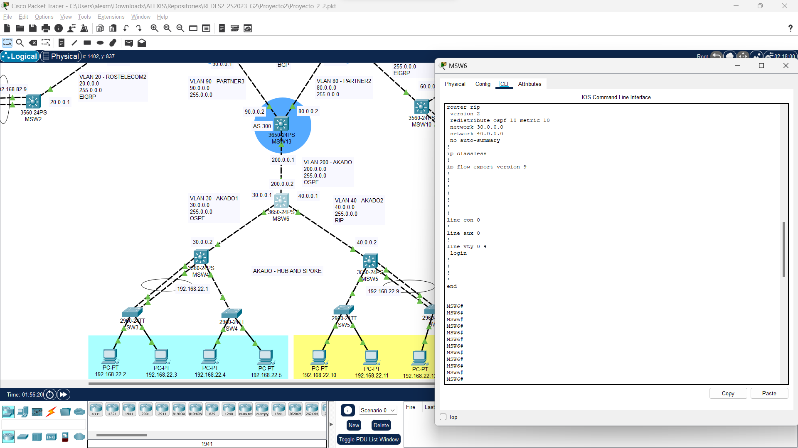

- Configuración de un Switch 3560(MSW5) para la realización del protocolo RIP añadiendo la version 2, con las redes conectadas directamente al switch:

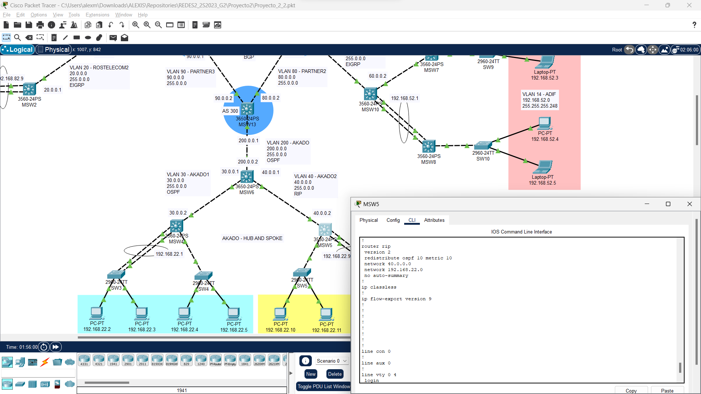

### Redistribute

Este es un proceso de compartir información de enrutamiento entre dos o más protocolos de enrutamiento diferentes dentro de una red. Esto se hizo para permitir que las rutas aprendidas a través de un protocolo de enrutamiento se vuelvan accesibles y utilizables por otro protocolo, por lo que se tiene lo siguiente:

- Configuración redistribute RIP-OSPF y OSPF-RIP:

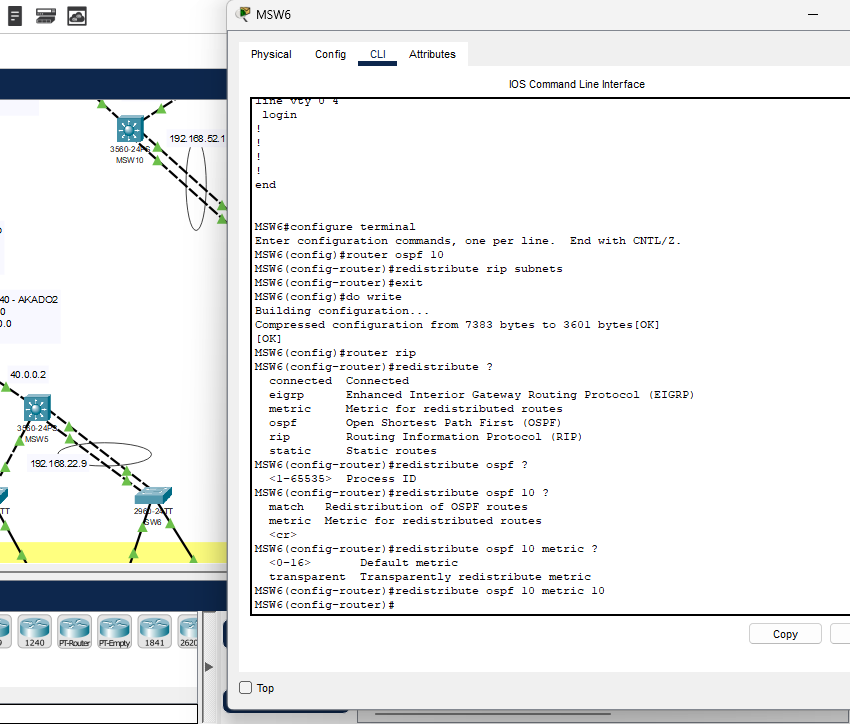

- Configuración redistribute BGP-OSPF y OSPF-BGP:

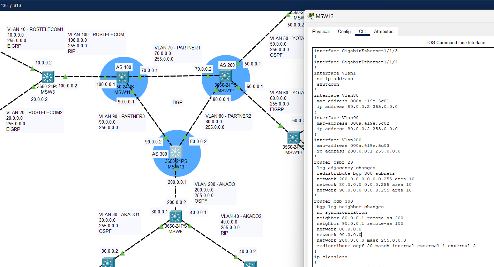

- Configuración redistribute OSPF10-OSPF20 y OSPF20-OSPF10:

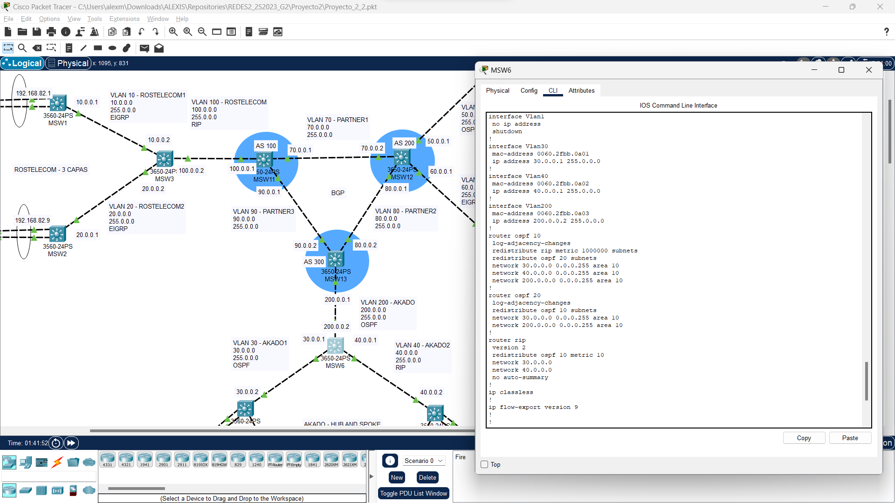

## Configuración de Área Central

Existen 3 redes dentro de esta área con una dirección determinada con la detalladas en la siguiente tabla:

|    Área       |   Dirección  | Máscara de subred |
| ----------    | ------------ | ----------------- |
|  Partner1     | 70.0.0.0     | 255.0.0.0         |
|  Partner2     | 80.0.0.0     | 255.0.0.0         |
|  Partner3     | 90.0.0.0     | 255.0.0.0         |

  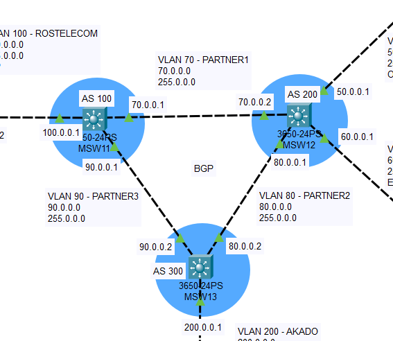

### VLAN

Iniciando esta configuración se tomó como base las VLAN's propuestas, como se muestra a continuación en la tabla:

| Nombre      | Número |
| ----------- | ------ |
|  Partner1   |  70    |
|  Partner2   |  80    |
|  Partner3   |  90    |

Para realizar esta configuración, se ingresaron las VLAN's respectivamente a las que cada switch tenía conectadas directamente.

### InterVLAN Routing

El enrutamiento interVLAN permite que los dispositivos en diferentes VLANs se comuniquen entre sí, lo que es esencial en estas redes para controlar el tráfico y mejorar la seguridad, por lo que se configuró sobre cada uno de los switches capa 3 del centro de la topología como se muestra en los siguientes casos:

- Configuración sobre MSW11: se agregan las interfaces Vlan de las mismas que tiene conectadas directamente, en este caso la Vlan 70, 90 y 100:

  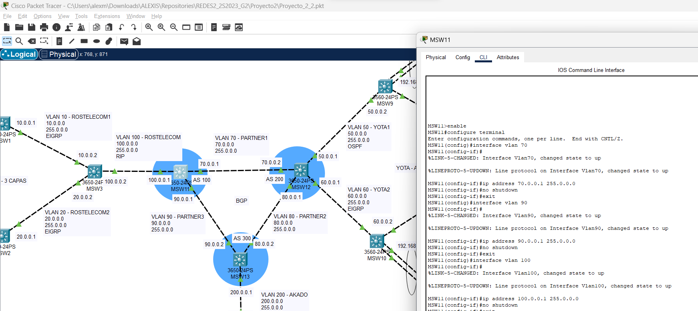

- Configuración sobre MSW12: se agregan las interfaces Vlan de las mismas que tiene conectadas directamente, en este caso la Vlan 50, 60, 70 y 80:

### BGP

- Configuración de un Switch 3650(MSW11) para la realización del protocolo BGP, con las redes conectadas directamente al switch este siendo el AS 100:

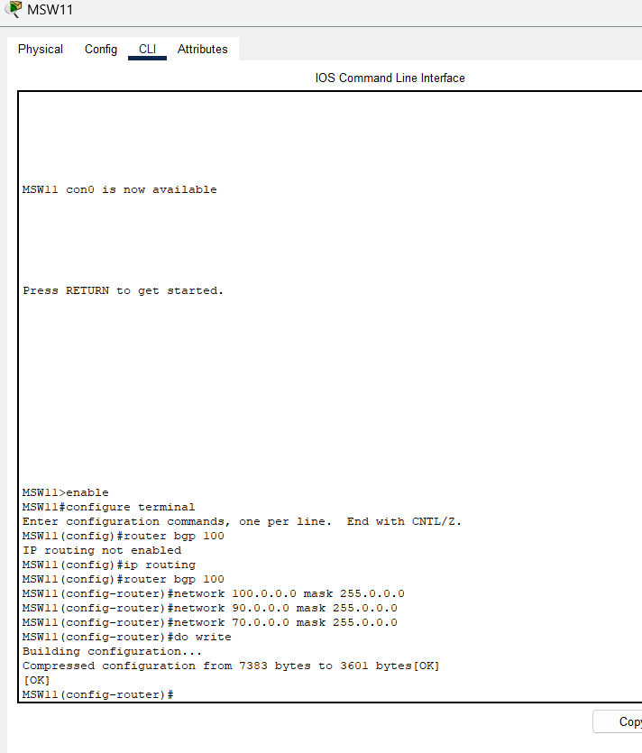

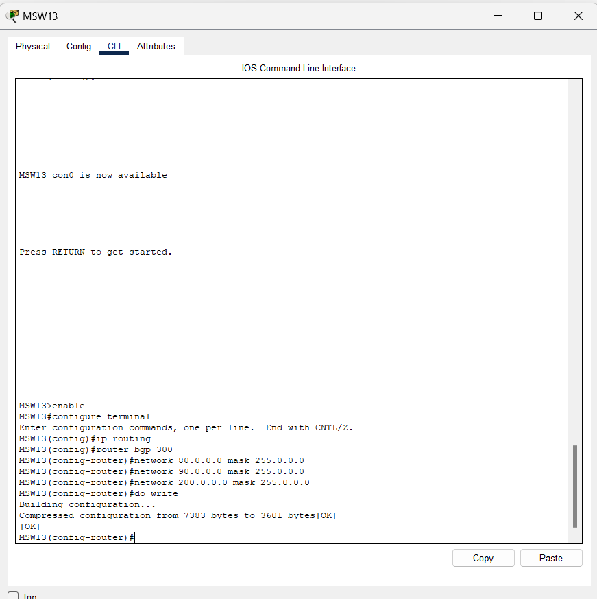

